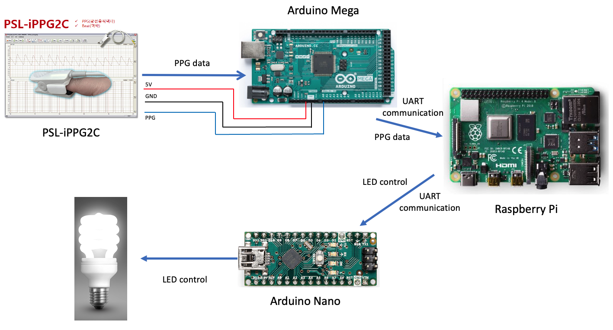

# ppg-sleep-stage
`-` Reference
- [Documentation of heart rate analysis](https://python-heart-rate-analysis-toolkit.readthedocs.io/en/latest/)
- [Documentation of pyhrv](https://pyhrv.readthedocs.io/en/latest/)

## Requirements
<a href="https://www.python.org/" target="_blank">
<a href="https://www.arduino.cc/" target="_blank">
<a href="https://www.raspberrypi.com/" target="_blank">

- [[PPG sensor] PSL-iPPG2C](https://www.devicemart.co.kr/goods/view?no=1328963)
- [Two Arduino boards (ex. Uno, Mega, Nano, etc.)](https://store.arduino.cc/products/arduino-uno-rev3)
- [Raspberry Pi4](https://www.raspberrypi.com/products/raspberry-pi-4-model-b/) or Laptop

## Summary

- `LED control system` by analyzing HR (Heart Rate) and it helps people to get sleep
- LED is getting darker when HR is decreasing or RR-interval is increasing